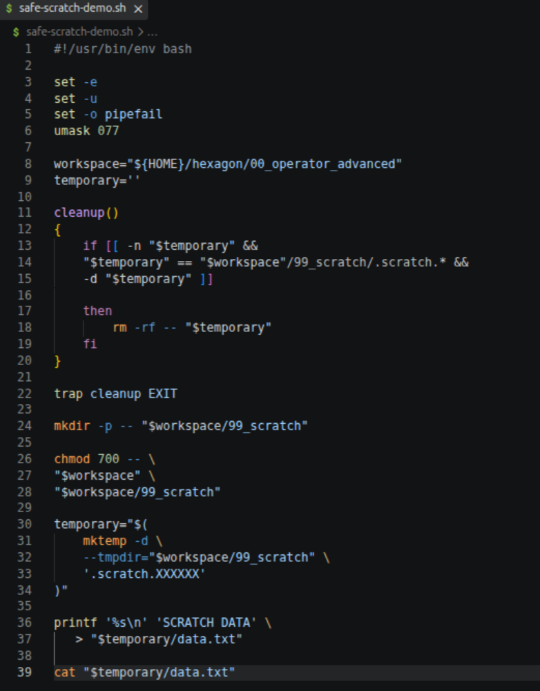
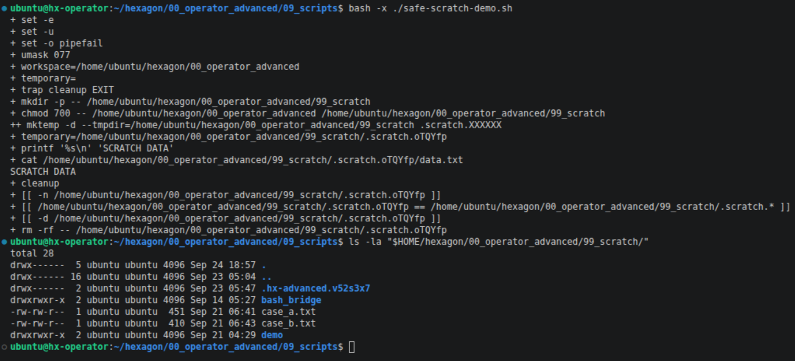

# Bash Safe Scratch Workflow

> **Status:** Guided Construction / Runtime Validated  
> **Environment:** Ubuntu Operator VM (`hx-operator`)  
> **Language:** Bash  
> **Privileges:** Normal User / No `sudo`  
> **Learning Path:** HEXAGON Red Team — Advanced Linux / Operator Foundations  
> **Date:** 2026-09-24

---

## Overview

This repository documents a small Bash workflow built during my Advanced Linux / Operator Foundations training.

The script creates a controlled temporary working directory inside an existing operator workspace, writes temporary data, reads it back, and automatically removes the temporary directory when the script exits.

The main objective was not to build a large automation tool.

It was to understand how several Bash mechanisms work together as one lifecycle:

```text
Controlled workspace
        ↓
Private scratch area
        ↓
Unique temporary directory
        ↓
Temporary data
        ↓
Script exit
        ↓
Guarded cleanup
```

This was my first serious multi-block Bash script combining variables, path construction, a function, conditional checks, `mktemp`, `trap`, permissions, and cleanup logic.

The final workflow executed successfully.

I do not present this as independent Bash scripting mastery or as a script I could already reconstruct completely from memory.

---

## What the Script Does

The script:

- enables stricter Bash execution behavior;
- applies `umask 077` for private-by-default object creation;
- defines a controlled workspace and scratch area;
- creates a unique temporary directory with `mktemp`;
- stores the generated directory path in a variable;
- writes `SCRATCH DATA` to `data.txt`;
- reads the temporary file back;
- registers a cleanup function with `trap`;
- validates the temporary path before deletion;
- removes the temporary directory when the script exits.

A central part of the exercise was understanding that:

```text
temporary
```

is a variable containing a **filesystem path**.

Therefore:

```bash
"$temporary/data.txt"
```

means:

```text
stored temporary-directory path
              +
          /data.txt
              ↓
        full file path
```

That data-flow model made the later cleanup logic much easier to understand.

---

## Safety Decisions

The workflow includes several defensive choices.

### Private creation

```bash
umask 077
```

One important correction to my earlier mental model was understanding that `umask` is not another form of `chmod`.

`chmod` sets or changes permissions on existing objects.

`umask` removes permissions from the normal creation mode when new objects are created.

---

### Controlled temporary location

The temporary directory is created inside:

```text
$HOME/hexagon/00_operator_advanced/99_scratch
```

using:

```bash
mktemp -d
```

with the template:

```text
.scratch.XXXXXX
```

This produces a unique directory while keeping the temporary work inside a known training workspace.

---

### Guarded cleanup

The cleanup function does not blindly delete whatever happens to be stored in the variable.

Before `rm -rf` is allowed to execute, the script checks that:

- the variable is not empty;
- the path matches the expected `.scratch.*` location;
- the path currently refers to a directory.

Only then does it run:

```bash
rm -rf -- "$temporary"
```

The `--` is used defensively to mark the end of command options before the path argument.

---

# Evidence

## Evidence 01 — Complete Script



The complete script fits into a single editor view.

The screenshot shows the full workflow, including:

- strict Bash options;
- `umask 077`;
- workspace and temporary-path variables;
- `cleanup()`;
- `trap cleanup EXIT`;
- permission handling;
- `mktemp`;
- temporary data creation and reading.

---

## Evidence 02 — Runtime Creation and Cleanup



The script was executed with Bash tracing enabled:

```bash
bash -x ./safe-scratch-demo.sh
```

The trace shows a real temporary directory being created:

```text
.scratch.oTQYfp
```

The script then accesses:

```text
.scratch.oTQYfp/data.txt
```

and produces:

```text
SCRATCH DATA
```

At script exit, the registered cleanup function runs, validates the path, and removes that temporary directory.

A subsequent `ls -la` of `99_scratch` no longer contains `.scratch.oTQYfp`.

The older `.hx-advanced.v52s3x7` directory visible in the final listing belongs to an earlier exercise and is not the temporary directory created by this run.

The runtime evidence therefore shows the intended lifecycle:

```text
CREATE
  ↓
USE
  ↓
EXIT
  ↓
CLEANUP
```

---

# Learning Friction and Troubleshooting

The final script is small, but combining the individual mechanisms was considerably harder than reading them separately.

One of the main difficulties was understanding the execution timeline.

The cleanup function appears near the beginning of the file even though the actual cleanup happens at the end.

The model became clearer when I separated:

```text
DEFINE
  ↓
REGISTER
  ↓
CREATE / WORK
  ↓
EXIT
  ↓
CLEANUP
```

Defining a function does not execute it.

Likewise:

```bash
trap cleanup EXIT
```

registers the cleanup function for later execution; it does not immediately trigger cleanup.

---

Another important point was the relationship between a variable and the filesystem object it refers to.

Initially, several expressions became easier only after I stopped thinking of:

```text
temporary
```

as "the directory."

The variable contains the **path to the directory**.

That distinction explains both:

```bash
"$temporary/data.txt"
```

and:

```bash
rm -rf -- "$temporary"
```

The variable provides the address of the filesystem object that another command operates on.

---

## Runtime Error During Construction

During construction I accidentally wrote:

```text
unmask
```

instead of:

```text
umask
```

A syntax check with:

```bash
bash -n
```

did not catch the mistake.

The script was syntactically valid because `unmask` could still be parsed as a command name.

The actual runtime then failed with a command-not-found error.

After correcting it to:

```bash
umask 077
```

the script executed successfully.

That exposed an important distinction:

```text
syntax validation
        ≠
runtime validation
```

A script can parse successfully and still fail when its commands actually execute.

---

# What I Understood

The strongest improvement from this exercise was not memorizing Bash punctuation.

It was understanding the script's data flow and lifecycle.

The exercise made the following ideas clearer:

- variables can store complete filesystem paths;
- child paths can be constructed from those stored paths;
- `mktemp -d` both creates a directory and returns its generated path;
- temporary objects are not automatically safe simply because they are temporary;
- `trap cleanup EXIT` registers cleanup for the end of the script;
- a destructive cleanup operation can be protected by multiple path checks;
- `umask` and `chmod` solve different permission problems;
- function definition order is different from runtime execution order;
- syntax validation and runtime validation provide different evidence.

The most useful mental model became:

```text
path
→ create object
→ store path
→ use object
→ exit
→ validate path
→ remove object
```

---

# Current Limitations

This repository intentionally does not present the exercise as independent Bash mastery.

At this stage:

- I can follow and explain the overall data flow;
- I can understand why the major safety mechanisms are present;
- I can trace how the temporary path moves through the script;
- I can interpret the runtime cleanup sequence.

However:

- I would not yet reconstruct the complete script from zero without references;
- exact Bash punctuation remains less stable than conceptual understanding;
- `set -e` and its exceptions require more practical exposure;
- `set -u` and `trap` are still relatively new mechanisms;
- exact `mktemp` and compound conditional syntax may still require lookup;
- reading and modifying a multi-block Bash script is currently stronger than independently designing one from scratch.

These limitations are part of the learning record rather than something to hide behind a successful runtime result.

---

## Final Status

```text
Script execution:          SUCCESSFUL
Temporary directory:       CREATED AND VALIDATED
Temporary data:            WRITTEN AND READ
EXIT cleanup:              VALIDATED
Conceptual data flow:      FUNCTIONAL
Independent reconstruction: NOT YET DEMONSTRATED
```

This is a small project, but it marks an important transition from understanding isolated Bash commands toward understanding how those commands can cooperate inside one controlled workflow.

---

**HEXAGON Red Team — Operator Development Record**
